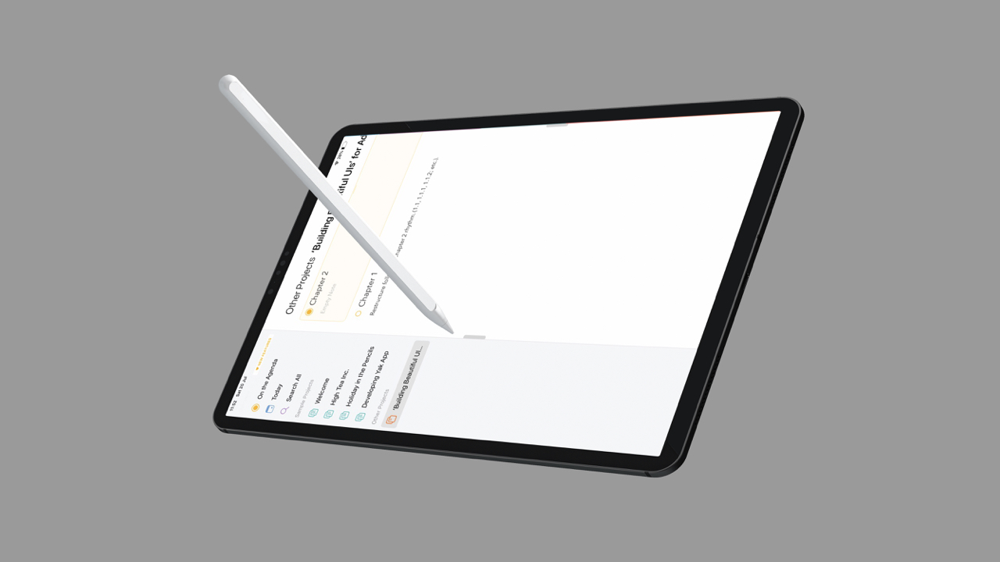
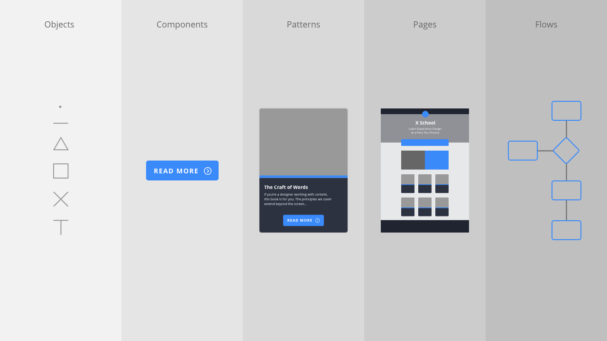
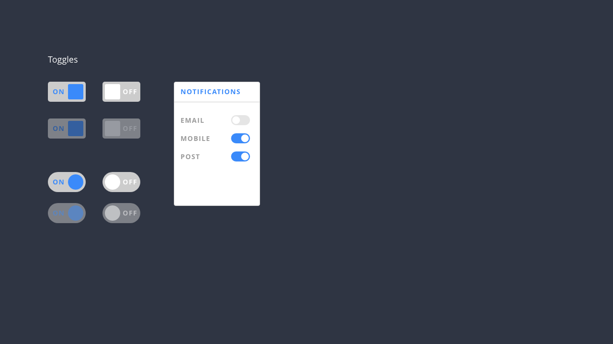
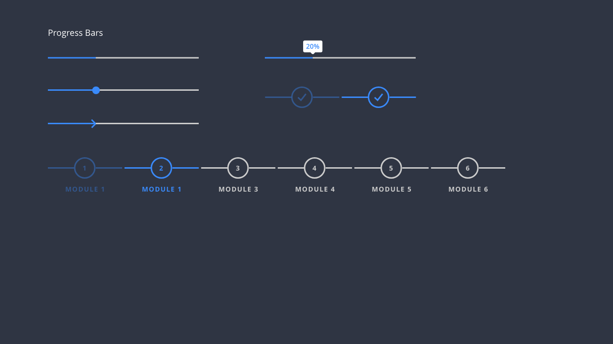
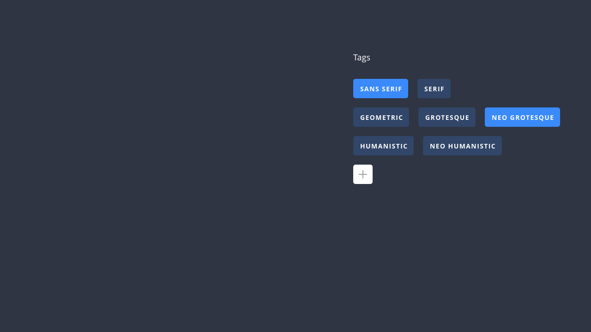
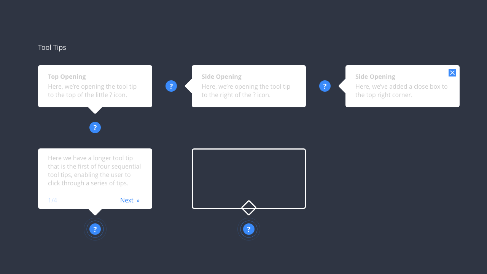
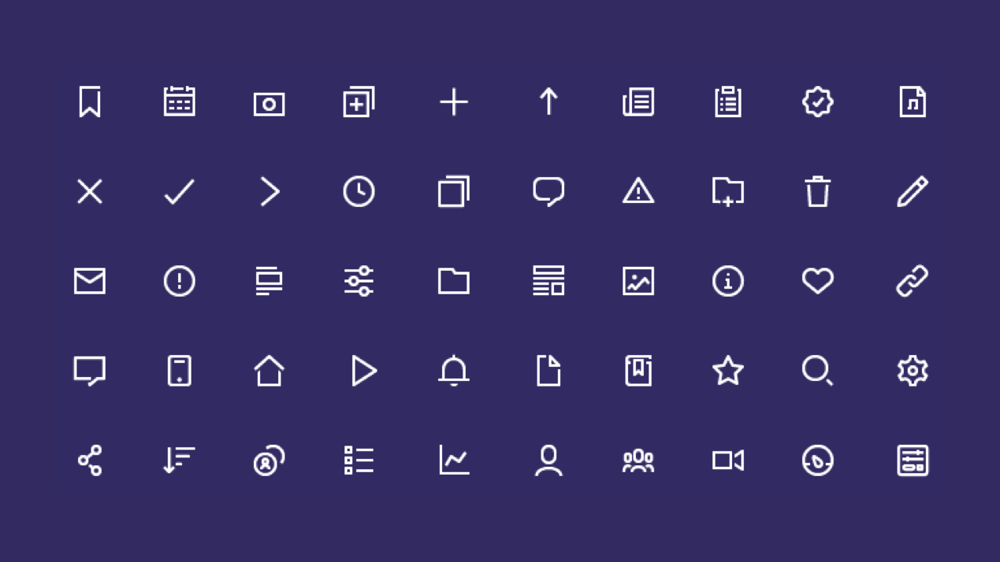
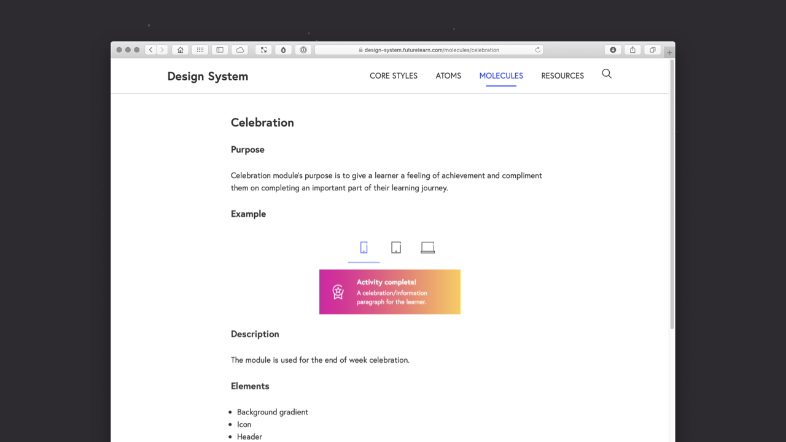

Chapter 2: The Building Blocks of Interfaces
============================================

<!-- 7,625 Words -->

**This chapter is at the pre-editing stage (Saturday, 20 July, 2019) whilst I gather some feedback on my naming conventions from a number of supersmart friends.**

**If you’re interested in reading it and [offering me some feedback](mailto:christopher@mrmurphy.com) I’d very much appreciate it. I’ve added some ‘NOTES FOR FEEDBACK’ immediately following these paragraphs, which provide context on the particular problem I’m revisiting. I hope to hear from you!**

😊

**As I’ve noted in the [overview](https://github.com/buildingbeautifuluis/bbuis/blob/master/00-Overview.md), this is a work in progress and I’m sharing it here in draft form. It isn’t finished, but I hope it provides some value as I finalise all of the chapter content.**

- - -

NOTES FOR FEEDBACK
------------------

In the [May 2019 Update](https://theblog.adobe.com/xd-may-2019-update-create-design-systems/) to XD, **Adobe changed its terminology and introduced supercharged ‘symbols’, which they called ‘components’**. I was using the word components to mean something **higher up the chain of complexity**, but I think I need to revisit my naming convention as the whole book is built around this naming convention and I don’t want to introduce confusion.

In light of how Adobe is using the term components, and through further research – especially looking at GOV.UK’s [Design System](https://design-system.service.gov.uk), which uses components differently to how I had used the term – I think I need to rethink the ‘Objects → Elements → Components’ part of the equation.

It’s worth noting before I dive in, that I purposely didn’t use Brad Frost’s Atomic Design naming conventions (it’s interesting, it has changed how we think about systems, and Brad is a friend of mine). However:

1. I find the terminology (which mixes chemistry and biology metaphors) very confusing, and my students and studiomates find it confusing, too.

2. Atomic Design is very much in the realm of front-end development and I think UX /+ UI is evolving to become a separate specialism – which, for a lot of UX /+ UI designers, like me, doesn’t involve front-end development – but does, of course, involve **an understanding of code**.

**Here’s where I am just now (20 July, 2019):**

When I was teaching my students at Belfast School of Art last semester, I used the following terminology, which I’ve used in the book (v1, below):

	Objects → Elements → Components → Pages → Flows

You can see a visual of this [here](images/ch2/objects-elements-components-2px.png).

+ An **object** is a basic building block from which we build interfaces: points (circles), lines and planes; icons; and typographic elements. (Icons are built from objects, too.)

+ An **element** is *created from objects* and, as I’ve used it below, is something like [a button](images/ch2/buttons.png), [a toggle](images/ch2/toggles.png), or [a progress indicator](images/ch2/progress-indicators.png), etc..

+ A **component** is *created from elements* and, as I’ve used it below and in the next chapter, is something like a [card](https://design-system.futurelearn.com/molecules/card), a [date picker](https://design-system.futurelearn.com/molecules/date-input), or a [feed item](https://design-system.futurelearn.com/molecules/feed-item), etc..

+ A **page** is *created from objects, elements and components*.

+ A **flow** is *created from a series of pages that are linked together*. A flow is what we’re building towards – **from the ground up** – and is the most complex part of the equation.

Last night, at 2.30 am, all of this collapsed, after re-reading GOV.UK’s [Design System](https://design-system.service.gov.uk/) documentation.

😢

**I need to fix this now – as it impacts the whole book – which is why I’m asking for your help, which I very much appreciate!**

🤗

GOV.UK’s *components* are what I’ve been calling *elements* so I need to rethink my approach (I think) and move components further down the chain of complexity.

Here is how GOV.UK defines [components](https://design-system.service.gov.uk/components/):

> Components are reusable parts of the user interface that have been made to support a variety of applications.
> —GOV.UK

Put simply, GOV.UK’s *components* are my *elements*, so I might need to rethink my approach like this:

	Objects → Components → ???? → Pages → Flows

This would have the benefit of fitting with how XD is now naming supercharged symbols as components. It would also build on existing GOV.UK naming conventions, paving the cowpaths, which is a good thing.

Here is how GOV.UK defines [patterns](https://design-system.service.gov.uk/patterns/), which are what I was calling components:

> Patterns often use one or more components and explain how to adapt them to [different] contexts.
> —GOV.UK

This now strikes me as making much more sense. So: **objects** are used to build **components**, which are then organised into **patterns**, that are then used to build **pages** and, subsequently, tied together as **flows**.

My gut tells me to follow GOV.UK’s naming conventions so I’m not introducing **yet another methodology** that will confuse people. So, I’m thinking of changing the naming convention to this:

	Objects → Components → Patterns → Pages → Flows

One added benefit of using the term ‘patterns’ is that **I can also reference Christopher Alexander’s 1977 book *A Pattern Language*, which I cover a great deal in my teaching**.

[I’d welcome your thoughts on this.](mailto:christopher@mrmurphy.com) I’m so far into the forest I could really benefit from an outside view to help me see the trees – and the forest! – a little more clearly.

All I really need is a simple Y / N answer (unless you have further thoughts) to the following question. Is this a better naming methodology?

	Objects → Components → Patterns → Pages → Flows

If you’d like to see these naming conventions in action, I’ve created [a short document – drawn from this chapter – that uses these terms](https://github.com/buildingbeautifuluis/bbuis/blob/master/99-Naming-Conventions.md).

**Thank you!**

- - -

Table of Contents
-----------------

+ [Section 1: Interfaces Are Like LEGO](https://github.com/buildingbeautifuluis/bbuis/blob/master/02-Chapter-2-The-Building-Blocks-of-Interfaces.md#section-1-interfaces-are-like-lego)
+ [Section 2: Objects → Components → Patterns → Pages → Flows](https://github.com/buildingbeautifuluis/bbuis/blob/master/02-Chapter-2-The-Building-Blocks-of-Interfaces.md#section-2-objects--elements--components--pages--flows)
+ [Section 3: A Library of Elements](https://github.com/buildingbeautifuluis/bbuis/blob/master/02-Chapter-2-The-Building-Blocks-of-Interfaces.md#section-3-a-library-of-elements)
+ [Section 4: The Wonderful World of Icons](https://github.com/buildingbeautifuluis/bbuis/blob/master/02-Chapter-2-The-Building-Blocks-of-Interfaces.md#section-4-the-wonderful-world-of-icons)
+ [Section 5: Design Systems](https://github.com/buildingbeautifuluis/bbuis/blob/master/02-Chapter-2-The-Building-Blocks-of-Interfaces.md#section-5-design-systems)
+ [Closing Thoughts and Further Reading](https://github.com/buildingbeautifuluis/bbuis/blob/master/02-Chapter-2-The-Building-Blocks-of-Interfaces.md#closing-thoughts)
+ [Downloadables](https://github.com/buildingbeautifuluis/bbuis/blob/master/02-Chapter-2-The-Building-Blocks-of-Interfaces.md#downloadables)

Summary
-------

In this chapter **I’ll introduce the fundamental building blocks that interfaces are made from**: Objects, Components, Patterns, Pages and Flows. **I’ll break apart a series of interface elements** – which I’ll also provide as swipe files for reference – **and I’ll analyse how everything we use in an interface is constructed from simple building blocks, or objects**.

I’ve created a series of supporting files – reference files and Adobe XD artboards – to accompany this chapter (and many of the other chapters). **These supporting files walk through the process for more visual learners and can be used alongside the book.**

<!--

The references to supporting files will need to be removed if we can’t agree a non-exclusive license for Adobe. This additional content is 100% developed by me and is outside the scope of the SoW, which is for a book and a glossary.

I’d like to grant Adobe a non-exclusive license as it will raise the profile of the book, but this 100% depends on licensing and IP agreements.

-->

Overview
--------

Over the following three connected chapters **I’ll progressively introduce the fundamentals of user interface design** step by step. These three chapters are essentially the heart of the book – I’d strongly encourage you to read all of them – **they will introduce you to the principles you need to master to become a fully-fledged user interface designer**.

In this chapter, ‘The Building Blocks of Interfaces’, I’ll introduce the idea of **a core set of components with which we can build interfaces**. These include: buttons, toggles, tags and other essential components. I’ll show how these components are constructed and explain **how they form the basis of a consistent, yet flexible, design system**.

In Chapter 3, ‘Information Architecture’, **I’ll explore how we can combine these components to create patterns, out of which we build pages**. These patterns include familiar design patterns, including ‘cards’, **popularised by Google’s [Material Design](https://material.io/design/components/cards.html) principles**. Lastly – as the chapter’s title promises – **I’ll explore the principles of information architecture**.

In Chapter 4, ‘Getting From A → B’, **I’ll tie everything together by introducing the idea of ‘journey mapping’ and ‘user flows’**. By focusing on how pages are connected together I’ll explore the last piece of the user interface jigsaw: **considering how users move through an interface**, getting from A → B.

With the overview of Chapters 2-4 mapped out, let’s get down to business and explore the fundamental building blocks of user interfaces, exploring how components are created.

Section 1: Interfaces Are Like LEGO
-----------------------------------

**CAPTION: With a mountain of LEGO bricks, we can build virtually anything. We’re limited only by our imagination. User interfaces are the same: Once we’ve created some basic components – buttons, toggles and tags, for example – we can build any UI we desire.** [Photograph by [Iker Urteaga](https://unsplash.com/@iurte) on [Unsplash](https://unsplash.com).]

When you’re starting on your journey as a user interface designer **it can be intimidating trying to work out how different interfaces are built**.

Take any interface, however, and you’ll see that **even the most complicated of interfaces is built up of simpler components and patterns**. By zooming in and starting with these components and patterns you can quickly develop an understanding of how UIs are constructed.

Working with my students at Belfast School of Art, I encourage them to **take existing interfaces and break them down into their constituent parts**. By using a [‘Master-Apprentice’](https://github.com/buildingbeautifuluis/bbuis/blob/master/10-Appendix-1-Master-Apprentice-Exercises.md) approach – analysing others’ interfaces and rebuilding them – **you not only learn about how interfaces are constructed, but you also begin to understand the principles that lie behind good interface design**.

### The Master-Apprentice Model

The Master-Apprentice model stretches back to the days of painters like [Rembrandt](https://oldmasters.academy/old-masters-academy-art-lessons/who-were-rembrandts-teachers-and-students) and I believe it’s worth revisiting. **By focusing on rebuilding others’ interfaces to start with, you learn to ‘train your eye’.** This approach also helps you to develop the techniques you need to master before putting them into practice in your own creative work.

In the 17th century, apprentices’s education was undertaken for a minimum of 2-3 years, and – at times – for as many as seven years. A two year apprenticeship was considered to be the minimum, with guild rules dictating that an apprentice couldn’t leave their master before their term had ended. An apprenticeship was an investment, with a total cost of 600-700 guilders, which could buy a small house at that time.

The good news is that – in our connected world underpinned by the web – **you can embark upon a ‘virtual apprenticeship’ at relatively little cost**. All you need is time and a willingness to work hard and learn. [Dribbble](https://dribbble.com/search?q=UI) is a good place to start. **Search for [UI](https://dribbble.com/search?q=UI), choose something you like and rebuild it.**

One small, but important point to note: What I’m **not** suggesting is **copying your finished user interface** by raiding Dribbble like a Viking. **I’m suggesting learning to use drawing tools – like XD – by deconstructing and rebuilding others’ work.**

**CAPTION: Dan Gold, a second year student on my Interaction Design programme at Belfast School of Art, created the above Master-Apprentice exercise. On the left is the original, by [Nadia Ivanova](https://dribbble.com/nadiat_t), on the right is Gold’s exercise.**

To help you on your learning journey **I’ve provided a series of [‘Master-Apprentice’](https://github.com/buildingbeautifuluis/bbuis/blob/master/10-Appendix-1-Master-Apprentice-Exercises.md) examples** in addition to the example above, so you can see how these exercises work.

I’ve provided examples of desktop, mobile (smartphone, tablet) and wrist UIs so **you can begin to develop an understanding of different interfaces across a range of contexts**. I created these myself so that I could develop my skills. I might be fast approaching 50 years old, but I’m still learning!

It’s worth stressing that I’m not the only seasoned designer who adopts this approach. Chris Coyier – the co-founder of [CodePen](https://codepen.io) and the wunderkind behind the wonderful [CSS Tricks](https://css-tricks.com) – also embraces the Master-Apprentice approach (although I suspect he doesn’t consciously call it this).

Coyier’s [rebuild](https://codepen.io/chriscoyier/full/KLWgVy) of Cultured Code’s [Things Status Board](https://culturedcode.com/status/) is a lovely example and ably demonstrates that **even designers with years of experience are still focused on developing their own learning**.

### LEGO FTW!

One of the reasons that LEGO is such a much-loved product is the fact that **from a series of individual building blocks you can make almost anything you put your mind to**. You’re limited only by your imagination.

Just like LEGO blocks can be combined to create relatively complicated constructions, so, too, **complex interfaces can be created from relatively simple components**.

Break apart any page – whether it’s desktop-, mobile- or wrist-based – and you’ll see that it’s created from a series of components and patterns. **Mastering how to draw these different components and patterns will put you in a position to create anything your UI requires.**

**CAPTION: This is a temporary image. It will be replaced by an image of an interface that I’ve deconstructed. Break apart any page and you’ll see it’s create from components and patterns. Mastering how to draw these building blocks is what will establish a firm foundation on which to build.**

The temptation when you’re starting out is to dive in at the deep end and try to build something all-encompassing and complicated. This isn’t an approach I’d recommend. **Taking on too big a challenge can quickly lead to frustration because you’ve undertaken a task that’s far too challenging and complex.**

A far better approach – one that LEGO also uses – is to **start with something simple and progressively add complexity as your skills develop**. Practice makes perfect and as Mr Miyagi – from the film [The Karate Kid](https://www.youtube.com/watch?v=fULNUr0rvEc) – emphasises: “Wax on. Wax off.” If you haven’t seen The Karate Kid: firstly, you should (the original, not the remake); secondly, Mr Miyagi’s sage advice is simple, but proven to be effective: practice, practice, practice.

In short: **Master the fundamentals and the rest falls into place,** or learn to walk before you attempt to run.

With that out of the way, let’s take a look at the different constituent parts that comprise an interface and begin to unravel them.

Section 2: Objects → Components → Patterns → Pages → Flows
----------------------------------------------------------

**CAPTION: Everything we build is created from relatively simple objects. By combining these objects in different ways we can create different user interface components, which can then be combined to create patterns that are then organised on pages. Link these pages together and we have the flows that underpin our user interface.**

**Everything we create is built from smaller parts.** At the simplest level, user interfaces are comprised of the following:

+ **Objects:** An object is a basic building block from which we build interfaces: points (circles), lines and planes; icons; and typographic elements. (Icons are built from objects, too.)

+ **Components:** A component is *created from objects* and is something like [a button](images/ch2/buttons.png), [a toggle](images/ch2/toggles.png), or [a progress indicator](images/ch2/progress-indicators.png).

+ **Patterns:** A pattern is *created from components* and is something like a [card](https://design-system.futurelearn.com/molecules/card), a [date picker](https://design-system.futurelearn.com/molecules/date-input), or a [feed item](https://design-system.futurelearn.com/molecules/feed-item).

+ **Pages:** A page is *created from objects, components and patterns*.

+ **Flows:** A flow is *created from a series of pages that are linked together*. A flow is what we’re building towards – **from the ground up** – and is the most complex part of the equation.

In this chapter, **I’ll be focusing on components, demonstrating how they can be built from simple objects: points (circles), lines and planes; icons; and typographic elements**.

In the next chapter, I’ll show how these **components can be combined to create patterns and pages**, which form the backbone of our user interfaces. In the following chapter, I’ll explore how **we can tie these separate pages together into flows that allow a user to navigate through an interface**.

This approach – Objects → Components → Patterns → Pages → Flows – is similar to Brad Frost’s [Atomic Design](http://atomicdesign.bradfrost.com/chapter-2/) methodology. I never dived deep into science, so **I find Frost’s naming convention – which features a metaphor of ‘atoms’ and ‘molecules’ from the world of chemistry, and ‘organisms’ from the world of biology – a little confusing**.

Frost’s methodology is also **directed primarily at front-end designers who are using HTML, CSS and JavaScript**. Designing interfaces in a tool like Adobe XD is increasingly separated from the world of code. (Although, to be clear – in case I spark the ‘designers should know how to code’ debate – **it’s critical at the very least to have an understanding of code!**)

That Frost’s Atomic Design methodology has shaped our thinking, is beyond doubt. **His approach encouraged us to think about what we build in a much more systematic way:** laying the foundations by focusing on re-usable, ‘atomic’ elements that are then orchestrated into progressively more complex elements that are then – collectively – used as the basis for pages.

That said, **I’ve adopted a less complicated naming system, which I believe is easier to understand**, after having tried and tested it on my students and studiomates.

Given the rise of different specialisms that we’re seeing emerging in the world of user experience design, I believe **there’s a need for a different naming convention, one that’s specifically focused on visual designers creating user interfaces**.

Looking at the illustration at the beginning of this section, I prefer the labels: **objects, components, patterns, pages and flows**. I find these labels easier to grasp and they should, I feel, need no explanation.

I’ve drawn these terms by looking at the work of others, particularly the award-winning GOV.UK team’s work on the [GOV.UK Design System](https://design-system.service.gov.uk). As GOV.UK put it:

> Learn from the research and experience of other service teams and avoid repeating work that’s already been done.

There’s no need to reinvent the wheel and, in the spirit of reusing existing naming conventions, I’ve drawn my naming methodology from their work, adding the term ‘objects’ to explain the fundamental building blocks from which all of our user interfaces are created.

### Objects → Components

**Every component that we create for a user interface is built from smaller objects.** By learning to mentally break apart the components we encounter – into their constituent objects – we begin to understand how they are constructed.

Analysing how existing components are built we see that **everything we see in a user interface – a component, a pattern or a page – is comprised of other, simpler objects**.

**CAPTION: In the above example, the button component is comprised of smaller, simpler objects: a plane of colour; some typography; a circle and two lines that form an arrow.**

This idea – **of building complexity from the object up** – lies at the heart of everything we do. Grasping it we understand that **components – the fundamental units from which we build interfaces – are created from relatively simple objects**.

Understanding how the fundamental building blocks of interfaces work – at a simple, component level – helps us to develop a language of components that we can then combine and build into complex interfaces through the creation of patterns and pages.

One significant benefit of the approach of **building from the component up** is that **we’re effectively constructing a design system to ensure our interfaces are consistent** (and easier to build). I’ll explore design systems in the closing section of this chapter, for now, let’s acquaint ourselves with the anatomy of some further components.

### Anatomy of a Component

<!-- This opening paragraph needs to be rewritten. It feels a little too much like notes to myself at the moment. -->

In this section, I’ll unravel a few more components to further underline how we can re-use objects to create consistent user interfaces. **I’ll also stress the importance of paying attention to the details, which are a critical component of successful UIs.** As Charles and Ray Eames famously noted:

> The details are not the details; they make the product.

By reusing a series of core objects to build your components, **your user interface benefits from a consistent and systematic approach**. By working with a core set of objects you ensure that the details take care of themselves. As you start to build your components, **it’s important to put some thought into their consistency**.

User interfaces that are inconsistent are not only aesthetically poor, but they also **lead to confused and frustrated users**, which can result in even the most promising of digital products to fail.

Consistency isn’t just about **how user interfaces look**, it’s also about **how user interfaces behave**. I’ll explore behaviour in depth in [Chapter 7: Animating Interfaces](https://github.com/buildingbeautifuluis/bbuis/blob/master/07-Chapter-7-Animating-Interfaces.md), so I’ll be focusing in this chapter on the look of your components, but keep in mind behaviour – and feel – is important, too.

**CAPTION: This is a temporary image. It will be replaced by an image of four components that shows how they are consistently built. I’ll be highlighting: stroke widths; consistent border radius, colours, etc.. (Show: a button, a toggle, a tag and a tool tip.)**

As you build your components, consider how they are consistently:

+ aligned;
+ sized; and
+ scaled.

It’s also import to **consider the relationships between your components** and how they correlate to each other. It’s highly unlikely that your components will exist in isolation. I’ll explore clustering, proximity and relationships in the next chapter, but **as you build different components, bear in mind that they’ll be existing as part of a wider system**.

<!--

I might want to reword the border-radius bullet point. Many successful  designs use considered, but different corner-radii.

-->

It’s important to focus on consistency, ensuring that:

+ line weights are the same thickness throughout (unless there’s a reason for them not to be);
+ your colour palette is consistent;
+ any elements with a border-radius uses the same radius; and
+ padding within elements is the same.

**This level of attention to detail is what sets apart the masters from the amateurs.** It might seem overwrought, but the benefits of this approach can’t be stressed highly enough. We’re striving for as close to perfection as we can achieve!

Section 3: A Library of Components
----------------------------------

**CAPTION: In the above example, we see a range of different components: buttons (in various states); stars, perhaps for a rating system; social icons; scroll buttons; and search boxes. Each of these components is – as we’ve seen – quite simply constructed, according to a consistent system.**

Now that we understand how components are constructed, it’s time to dive in and explore some of the components you might need for your user interface designs. Where possible, if a component exists as a design pattern, it’s best to use this.

As I noted in the preceding chapter, users have a mental model of how interfaces work, so **try – as much as possible – to work within existing conventions**. By doing so, your users will at least have a head start when using your interface.

The following isn’t an exhaustive list, but it does provide an overview of some typical components you’ll need to consider.

There are many, many more components in user interface design. Ever-helpful, usability.gov have put together lots of useful information at [User Interface Elements](https://www.usability.gov/how-to-and-tools/methods/user-interface-elements.html). As they put it:

> When designing your interface, try to be consistent and predictable in your choice of interface elements.
> 
> Whether they are aware of it or not, users have become familiar with elements acting in a certain way, so choosing to adopt those elements when appropriate will help with task completion, efficiency and satisfaction.

The interfaces you design won’t necessarily need **all** of the components that usability.gov list, but it will include a substantial number. As ever, if a pattern for something exists, use it. Sticking to these mental models as closely as you can will **result in a user interface that’s clearer and more easily understood**.

**CAPTION: This is a temporary image. It will be replaced by an image of four buttons. In the above example, we see four types of button: 1. A text button (for low emphasis); 2. An outlined button (with slightly more emphasis); 3. A solid button (with high emphasis); and 4. A button with an active state (perhaps being pressed).**

#### Buttons

Buttons indicate an action – on click or touch – that users can take, and are typically labelled with text, an icon or both. You’ll use them throughout your interface in places like: dialogs, forms and toolbars.

Google’s Material Design guidelines have [a useful overview of buttons](https://material.io/design/components/buttons.html) with an interactive tool that lets you preview button components and their different variations.

When designing a button, try and ensure it’s clearly communicated within your interface and looks ‘clickable’. This is particularly important if your button is for a [‘call to action’](https://www.optimizely.com/uk/optimization-glossary/call-to-action/). As the above illustration shows, you can adjust the emphasis of a button by varying its design.

**CAPTION: This is a temporary image. It will be replaced by an image of a series of different types of toggles. Toggles (or switches) allow users to change settings between two states: on / off, for example.**

#### Toggles (Or Switches)

Toggles or switches **enable users to complete tasks that require binary choices to be made**, for example, turning various settings on or off.

In addition to toggles or switches, radio buttons or checkboxes can be used, depending on the content you’re designing. **Toggles or switches should be used instead of radio buttons or checkboxes when the choice is binary: A or B.**

Toggles allow users to change settings between two states, for example: activating or deactivating something. **Ensuring the on and off states are visually distinct improves toggles usability.**

Once again, Google’s Material Design guidelines have [a useful overview of selection controls](https://material.io/design/components/selection-controls.html) that’s well worth reading.

**CAPTION: This is a temporary image. It will be replaced by a better spaced image with more examples. At the simplest level, we might use two different colored lines as a progress indicator. We can also add complexity to develop richer progress indicators, for example, including animation.**

#### Progress Indicators

<!--

Add this?

**Indeterminate indicators** express an unspecified amount of wait time. They should be used when progress isn’t detectable, or if it’s not necessary to indicate how long an activity will take.

-->

Progress indicators **communicate what stage a user is as at as they progress through a series of tasks**. They can also be used to **indicate other types of information, for example, the progress of a download**.

Progress indicators can be:** dynamic**, for example, providing user feedback about the progress of a download; or **static**, for example, showing where a user is in a sequence of tasks.

Progress indicators are useful for communicating time and alleviating your users’ concerns by showing them that **something is happening**. There is also an opportunity – should your design warrant it – to design progress bars designed to **[delight users](https://www.justinmind.com/blog/10-inspiring-progress-bars-that-delight-users/)** while they wait.

Progress indicators come in both linear and circular forms, as in the above example. Linear progress indicators are composed of two required elements:

1. **Track:** The track is a fixed width rule, with set boundaries (establishing the beginning (0%) and end (100%)) for the indicator to travel along.

2. **Indicator:** The indicator animates along the length of the track.

**As I noted above, it’s important to handle your interface elements consistently.** If you’ve used a circular progress indicator for a refresh action on one screen, that same action shouldn’t use a linear indicator on another screen.

**CAPTION: This is a temporary image. It will be replaced by a better spaced image showing a series of tags designed in different way. Tags can be used to communicate different groupings and can also be dynamic, interacted with like buttons, here indicating which tags are selected.**

#### Tags

Tags are useful in lots of different contexts, for example, **in profile patterns or in content-driven pages**. They can be used to:

+ filter content;
+ make suggestions; or
+ trigger actions.

When designing tags, it’s important to **ensure that they are visually and behaviourally consistent**. Tags are often integrated into components, for example, a set of tags indicating interests on a user profile card, as in the example above. <!-- TK Seems short. -->

**CAPTION: This is a temporary image. It will be replaced by a better spaced image. At the simplest level, we might use two rectangles to create a tool tip, as shown above.**

#### Tool Tips

As the digital products we design and build become ever more complex, it’s important to provide users with a helping hand where possible.

Tool tips are perfect for providing users with additional informative text when users hover over, focus on or tap elements. **When designing tool tips, it’s important to consider their behaviour** and how they appear (considering, for example, transitions and timings).

Tool tips often appear **on top of the screen the user is currently interacting with**, saving a round trip back and forth to a help page. When designing tool tips **ensure that they don’t hide or obstruct the components they are referring to**.

Tool tips often fade in, remain present while the user is interacting with them and then automatically fade out when their purpose has been served. As I noted above, I’ll explore these behavioural attributes in more depth in [Chapter 7: Animating Interfaces](https://github.com/buildingbeautifuluis/bbuis/blob/master/07-Chapter-7-Animating-Interfaces.md).

<!--

Make a video like this:

https://storage.googleapis.com/spec-host-backup/mio-design%2Fassets%2F0B8wSqcLwbhFuYlpHNGcxdXRfZkE%2F01-tooltip-interaction.mp4

-->

Section 4: The Wonderful World of Icons
---------------------------------------

**CAPTION: Vic Bell’s Gloo icons were designed to help app designer Roberto Ortiz inject a little more life and character into his user interface designs. These are just a handful drawn from [a very detailed and precise icon set created for the project](https://www.behance.net/gallery/59585629/Gloo).**

Icons aren’t really the same as components, rather **you might use them within components or in addition to components** to create a user interface that communicates clearly. **Icons are an incredibly powerful part of the UI designer’s toolkit** and are an important part of user interface design.

Icons, or pictograms, **convey information through the use of representational symbols** and are useful where **cross-cultural communication** is important.

**You’ve doubtless encountered icons, certainly you will have in an airport when you’re perhaps lost** – in a strange land, where you perhaps don’t speak the local language – and are looking for something. **Icons help you** to: find a toilet (should you need to spend a penny); find a taxi rank (if you’re in a hurry); or find the departures gates (when you’re invariably running late).

The use of icons in this context, and their ability to supercede language, are **a testament to their power as non-verbal forms of communication**. It’s this ability to transcend language – working across different languages, or accompanying different languages – that makes them so useful in interface design.

We live in an increasingly global world and **the websites and applications we build often have a global audience**. As such, adding icons to your UI toolbox is a great way to ensure your interfaces speak to the widest possible audience.

Drawing icons is a specialist skill (although like any skill, it can be learned). There are many talented icon designers and I’ll be interviewing a particularly gifted one – Vic Bell – in [Chapter 8: Project X-Rays](https://github.com/buildingbeautifuluis/bbuis/blob/master/08-Chapter-8-Project-X-Rays.md).

If your budget won’t stretch to cover a specialist icon designer, [The Noun Project](https://thenounproject.com) is an excellent resource that is bound to have an icon to suit every eventuality.

Founded in 2010, The Noun Project, “celebrates the world’s visual language,” and offers over two million curated icons created by a global community.

That said – as the illustrations in this chapter clearly demonstrate – **commissioning a bespoke icon set by a specialist designer can add a great deal of personality and life to your user interface design** and is worth considering.

### From Cave Paintings to the Present Day

Icons have been used since the dawn of man as **a way of communicating without language**. The term icon derives from the Greek εἰκόνα (‘eikona’), meaning ‘image’, which is itself derived from from ‘eikénai’, which translates as ‘to be similar’ or ‘to appear’.

The use of pictograms, or icons, was pioneered at the 1964, 1968 and 1972 Olympic Games in the form of **pictographic ‘wayfinding systems’ to help visitors ‘find their way’**.

Just as these iconic systems helped people to find their way in a strange environment, so too, **we can use icons to help users find their way around an interface**.

One of the best known sets of icons are Otl Aicher’s icons for the 1972 Munich Olympic Games. The wonderful [otl aicher pictograms](https://www.piktogramm.de/en/) – a website celebrating Aicher’s groundbreaking work – delves into their history and the site features an excellent overview of [pictograms past and present](https://www.piktogramm.de/en/#c53) that is well worth reading. As the website notes:

> Pictograms were the precursors of writing historically speaking. Back in prehistory, Stone Age dwellers used pictorial symbols to record their experiences for posterity on cave walls.

This ‘pictorial language’ can still be read today: We might not be able to understand a Stone Age hunter-gatherer (if, that is, we were able to encounter one), but we can certainly look at a cave painting and unravel the story behind it.

It is this universality that makes icons so powerful. Using them we can design user interfaces that act as a ‘universal language’ for wayfinding within interfaces.

### A ‘Universal Language’ for Wayfinding

As I explored in Chapter 1, with the rise of personal computers and their subsequent move away from command-line interfaces towards graphical interfaces, **the use of icons emerged as a form of universal language to allow users to find their way around what were then unfamiliar operating systems**.

One of the best known examples of this were Susan Kare’s original icons for the [Macintosh](https://www.newyorker.com/culture/cultural-comment/the-woman-who-gave-the-macintosh-a-smile). Kare’s icons – designed using only black and white (due to the constraints of early screens) – have a timeless quality to them and it’s no surprise to see them housed [in the collection of New York’s Museum of Modern Art](https://www.moma.org/artists/38483).

**CAPTION: Susan Kare’s original icons for the Macintosh were instrumental in the rise of GUIs and icon-driven interfaces.**

By embracing metaphors – built around everyday objects – Kare was able to provide a helping hand to users new to GUIs enabling them to understand how the interface worked: **a piece of paper** represented a document, which you could store in **a folder** and, when you no longer needed it, you could move it to **a trashcan**.

Look at any interface and you’ll see icons in action. Returning to Vic Bell’s work, [her iconography for Uber](https://www.behance.net/gallery/53544233/Uber-Iconography) is a lovely suite of icons – designed at different resolutions – to allow the company to ensure its communication is consistent. 

On a smaller screen, where space is a premium, Bell has designed a distilled set of simpler icons. However, on a larger screen, where there’s more space she’s [embraced colour and added detail](https://dribbble.com/shots/3124553-Uber-Iconography). In this way, iconography can act as both a form of communication and a means of underlining a brand. A win win.

Section 5: Design Systems
-------------------------

**CAPTION: This is a temporary image. I’ll replace it with a montage of design systems including: Airbnb, IBM, Uber, MailChimp….**

As you design and build your user interface components, **it’s important to ensure that they follow a consistent visual language**. Do this at the component level and you will – by extension as you build patterns from components – have the basis of a design system.

Design systems have **changed the way we design and build both websites and applications**. They’re quickly becoming a cornerstone of large (and even small) organisation’s digital product design strategies.

Design systems are useful to learn about if you’re getting started in user interface design, because they encourage you to adopt a systematic approach towards the UIs you design.

**By adopting a systematic approach towards your UI as you build it, you can ensure that subsequent elements and components you add to your design follow a consistent trajectory.** The result is a unified look and feel as your website or application scales.

A detailed exploration of design systems is beyond the scope of this book, but I would wholeheartedly recommend reading up on them. I’d strongly recommend Alla Kholmatova’s [Design Systems: A Practical Guide to Creating Design Languages for Digital Products](https://shop.smashingmagazine.com/products/design-systems-by-alla-kholmatova?utm_source=shop&utm_medium=sidebar-widget) as a starting point. I have a copy and it’s **filled** with Post-It Notes!

**CAPTION: FutureLearn’s design system ensures that everything the FutureLearn team, and its partners, design and build is considered, cohesive and consistent.**

Kholmatova shephered the development of FutureLearn’s [Design System](https://design-system.futurelearn.com), which is also worth looking at. Her knowledge of design systems is unparalleled and her book is excellent and well worth owning.

<!-- More on Futurelearn here, given the image above. perhaps mention Brad Frost’s methodology, modified. -->

The good news is that, **if you’re building from the component up – as this book encourages – you’ll have a head start on building a design system**, because the methodology I recommend – Objects → Components → Patterns → Pages → Flows – is designed to be built in a scalable manner, from the component up.

### What is a design system?

Put simply, a design system is a collection of components and patterns that can be combined and reused to build digital products.

<!--

It’s a little more complicated than this, but this isn’t a book about design systems and I don’t want to get too lost in explaining them. That said, I may need to widen this definition a little more.

-->

Returning to the LEGO metaphor I used in [Section 1](https://github.com/buildingbeautifuluis/bbuis/blob/master/02-Chapter-2-The-Building-Blocks-of-Interfaces.md#section-1-interfaces-are-like-lego), a design system is like having a series of LEGO bricks that are brand new (shiny and right out of the box).

When you buy a LEGO kit, the bricks it ships with are designed to fit together visually and aesthetically. (Unlike the giant boxes of LEGO bricks that you accumulate over time!)

A design system takes a similar approach. Instead of building components and patterns in an ad hoc manner as you need them, **you take a systematic approach so that everything fits together aesthetically**. As you add new components and patterns to your system, you draw on your design system to ensure consistency.

Embracing design systems pays off with a number of incredibly valuable benefits. A design system ensures:

+ your user interface is consistent;
+ your components and patterns are faster to design and build; and
+ your collaboration with others is considerably  smoother.

Embracing a design system also results in more consistent branding for the different projects that you work on, leading to happier clients.

I touched on styleguides in [Chapter 1: Designing Interfaces](https://github.com/buildingbeautifuluis/bbuis/blob/master/01-Chapter-1-Designing-Interfaces.md#section-5-ui-here-and-now) when I introduced styleguides.io, which gathers pattern libraries and style guides, but it’s worth exploring design systems, specifically, here.

**CAPTION: Jad Limcaco’s [Design Systems Repo](https://designsystemsrepo.com/design-systems/) is an excellent resource to learn about design systems.**

If you’re looking for inspiration, [Design Systems Repo](https://designsystemsrepo.com/design-systems/) is an excellent place to start. Created by Jad Limcaco, a designer at Apple, it started life as a collection of resources – examples, articles and tools – for Limcaco’s personal reference.

Generously, Limcaco spent time (no doubt a considerable amount of!), organising and cataloguing these resources for the benefit of the wider design community. The result is a wealth of resources. The [articles](https://designsystemsrepo.com/articles/) that Limcaco has curated are particularly worth exploring.

### Learning from the trailblazers…

<!-- This section needs a screenshot to break it up. -->

GOV.UK’s [award-winning work](https://www.wired.co.uk/article/design-of-the-year) is celebrated worldwide. In 2013, The Design Museum in London selected the GOV.UK website as its **2013 Design of the Year Awards Winner**. The same year GOV.UK won **a prestigious black pencil at the D&AD Awards**.

Black pencils are only awarded for outstanding projects – they aren’t awarded every year – and GOV.UK now ranks alongside other black pencil winners including the iPhone (2008) and the iconic ‘Cadburry’s Gorilla’ advertisement (2010).

The [GOV.UK Design System](https://design-system.service.gov.uk) is a fantastic resource and, to the GOV.UK team’s remarkable credit, they have paved the way in opening up their processes and sharing the lessons they have learned.

Public sector organisations are **often rightly criticised for moving slowly thanks to their often bottomless wells of bureaucracy**. GOV.UK is the opposite, it moves quickly and is constantly exploring new ways to optimise its processes.

It’s a rare example of a public sector organisation teaching the private sector best practice. As the team put it:

> The GOV.UK Design System is for everyone, with a strong community sitting behind it. It brings together the latest research, design and development from across government to make sure it’s representative and relevant for its users.

GOV.UK offers ample lessons on:

+ **[Styles:](https://design-system.service.gov.uk/styles/)** Guides for applying layout, typography, colour and more;

+ **[Components:](https://design-system.service.gov.uk/components/)** A library of reusable, accessible components for buttons, checkboxes, tags and more; and

+ **[Patterns:](https://design-system.service.gov.uk/patterns/)** Best practice design solutions for specific user-focused tasks, all supported by written guidance.

Finally, GOV.UK has a thriving [community](https://design-system.service.gov.uk/community/) sharing best practice and **encouraging designers from the wider (non-governmental) community to get involved proposing and developing new components and patterns**.

If you haven’t explored GOV.UK’s Design System, I strongly suggest you take a look. The level of detail the GOV.UK team focus on – in the design system’s [button documentation](https://design-system.service.gov.uk/components/button/), for example – is, and I don’t think I’m guilty of hyperbole: breathtaking.

It’s refreshing (and very unusual) to see a government sector team moving faster than its private sector counterparts. Not only that, but the GOV.UK team is opening up as much of their work as possible. The [government design principles](https://www.gov.uk/guidance/government-design-principles) are rich with valuable advice and can offer the private sector – indeed, any organisation – lessons from which to learn.

If you’d like to get an idea of how far ahead the GOV.UK team are planning, they’ve even published their [Design System Roadmap Board](https://github.com/orgs/alphagov/projects/5?fullscreen=true) and [Design System Sprint Board](https://github.com/orgs/alphagov/projects/4) in the open.

Closing Thoughts
----------------

All being well, this chapter has introduced you to the core principals of **how to build consistently designed user interface elements** that will act as the foundation of your UI.

In the next chapter – [Chapter 3: Information Architecture](https://github.com/buildingbeautifuluis/bbuis/blob/master/03-Chapter-3-Information-Architecture.md) – I’ll introduce the idea of using these elements as the basis for constructing components and pages, so that you can further develop your understanding of user interface design. 🎉

Further Reading
---------------

There are many great publications, offline and online, that will help further underpin your understanding of the building blocks of interfaces. I’ve included a few below to start you on your journey.

+ Christian Leborg’s [Visual Grammar](https://amzn.to/31EaRoa) helps to explain the fundamental principles of visual grammar, the core graphic building blocks from which we build elements. It’s an excellent book that focuses on the foundations – point, line and plane – from which all interfaces are built.

+ Manuela Langella’s [Designing For User Interfaces: Icons As Visual Elements For Screen Design](https://www.smashingmagazine.com/2018/02/user-interfaces-icons-visual-elements-screen-design/) – sponsored by Adobe and published by the fine folks at Smashing Magazine – complements this chapter perfectly. Langella provides a thoroughly in-depth view of the role that icons can play as a part of user interfaces.

+ Lastly, I’d strongly recommend [Universal Principles of Design](https://amzn.to/2Fdftbn). It covers ‘125 Ways to Enhance Usability, Influence Perception, Increase Appeal, Make Better Design Decisions, and Teach through Design’ and I’ve used it as a backbone for my teaching since it was published.

Downloadables
-------------

I’ve created a series of supporting files – reference files and Adobe XD artboards – to accompany the chapter content above. **These supporting files walk through the process for more visual learners and can be used alongside the book.**

I’ve designed all of the XD artboards myself (except the swipe files, where I reference others’ work with accompanying analysis). **You’re free to use the content of the XD artboards to assist your learning, however, I retain the copyright.**

+ [XD Artboards](downloadables/ch2/chapter-2-all-artboards.xd)
+ [PDF Swipe File (With Example Elements)](#) [Coming soon.]
+ [Master-Apprentice Exercises](https://github.com/buildingbeautifuluis/bbuis/blob/master/10-Appendix-1-Master-Apprentice-Exercises.md)

You can download, adapt or transform the files (non-commercially, for educational purposes), but you cannot use them for commercial purposes.

+ [Copyright · Mr Murphy ®](https://mrmurphy.com/)

**I hope you can see from the supporting files that I put a lot of work into creating them. I’d appreciate your respecting their copyright.**

**#karma**

About the Author
----------------

### Christopher Murphy

[@fehler](https://www.twitter.com/fehler)

A designer, writer and speaker based in Belfast, Christopher mentors purpose-driven businesses, helping them to launch and thrive. He encourages small businesses to think big and he enables big businesses to think small.

As a design strategist he has worked with companies, large and small, to help drive innovation, drawing on his 25+ years of experience working with clients including: Adobe, EA and the BBC.

The author of numerous books, he is currently hard at work on his eighth, ‘Designing Delightful Experiences’, for Smashing Magazine and ninth, ‘Building Beautiful UIs’, for Adobe. Both are accompanied by a wealth of digital resources, and are drawn from Christopher’s 15+ years of experience as a design educator.

---

I hope you find this resource useful. I’m also currently working on a book for the fine folks at [Smashing Magazine](https://www.smashingmagazine.com) – ‘Designing Delightful Experiences’ – which focuses on the user experience design process from start to finish. It will be published in late 2019.

You might like to [follow me on Twitter](https://www.twitter.com/fehler) for updates on this book and other projects I’m working on.

**Copyright · Adobe XD + Mr Murphy Ltd.**